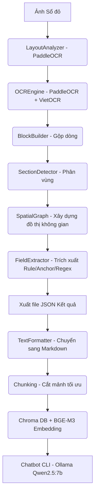
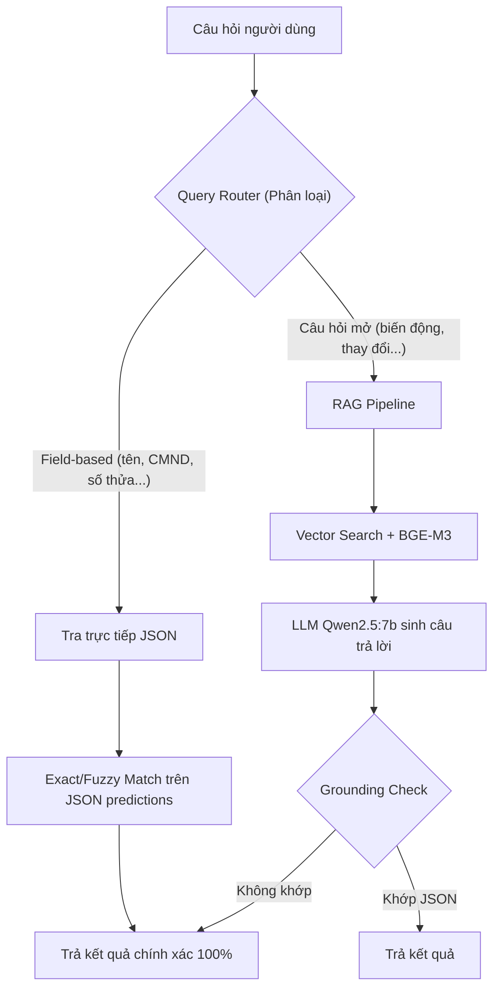

# BÁO CÁO TÓM TẮT KIẾN TRÚC & CÁC VẤN ĐỀ TRONG PIPELINE TRÍCH XUẤT SỔ ĐỎ

Báo cáo này tóm tắt kiến trúc thuật toán đang sử dụng trong dự án, chi tiết các vấn đề kỹ thuật đã phát hiện, giải pháp tạm thời đã áp dụng, **hạn chế còn tồn tại**, và **đề xuất cải tiến kiến trúc** cho từng vấn đề.

---

## 1. Kiến trúc thuật toán hiện tại (Pipeline Architecture)

Hệ thống được thiết kế theo mô hình lai (Hybrid): Kết hợp giữa **Trích xuất thông tin theo luật không gian (Rule & Graph-based Extraction)** và **Hỏi đáp tài liệu ngữ cảnh lớn (RAG - Retrieval Augmented Generation)**.

### Chi tiết các tầng trong Pipeline:

1. **Phân tích bố cục (Layout Analysis):**
   - Sử dụng `LayoutAnalyzer` để nhận diện các vùng chứa văn bản (`blocks`) trên ảnh Sổ đỏ. Cấu hình hỗ trợ mô hình `PP-DocLayout-L` hoặc fallback về `PaddleOCR`.

2. **Nhận diện chữ (OCR):**
   - Sự kết hợp của `PaddleOCR` (nhận diện vị trí chữ) và `VietOCR` (mô hình Transformer nhận diện nội dung tiếng Việt chính xác cao).

3. **Xây dựng khối văn bản (Block Builder):**
   - Gộp các dòng chữ nằm gần nhau theo chiều dọc và chiều ngang thành các đoạn văn (`blocks`) có cấu trúc.

4. **Phân loại vùng (Section Detection):**
   - Áp dụng các luật Regex dựa trên từ khóa (ví dụ: `Mục I`, `Mục II`, `Mục IV`) để phân chia văn bản thành các vùng chức năng (`holder_info`, `land_info`, `property_changes`).

5. **Trích xuất thuộc tính (Field Extraction):**
   - Sử dụng **Đồ thị quan hệ không gian (Spatial Graph)** để biểu diễn vị trí các khối chữ (trên, dưới, trái, phải).
   - `FieldExtractor` tìm kiếm các khối mốc (**Anchors** như: *"CMND"*, *"Bà"*, *"Thửa đất số"*) và dùng Regex hoặc quan hệ không gian để bốc ra giá trị của trường tương ứng.

6. **Tìm kiếm ngữ cảnh và Trả lời (RAG Pipeline):**
   - Định dạng toàn bộ dữ liệu cấu trúc thành Markdown để giữ nguyên tiêu đề mục.
   - Sử dụng `ChromaDB` làm cơ sở dữ liệu Vector với mô hình nhúng **`BAAI/bge-m3`**.
   - Chuyển ngữ cảnh tìm được vào mô hình ngôn ngữ lớn **`Qwen2.5:7b` (chạy qua Ollama)** để trả lời câu hỏi trực tiếp của người dùng.

---

## 2. Các vấn đề đã gặp, Giải pháp, Hạn chế và Đề xuất cải tiến

---

### Vấn đề 1: Ảo giác tên người (LLM Hallucination)

**Hiện tượng:** OCR quét đúng chữ `"BÀ: HỒ LỆ HỒNG"`, nhưng Chatbot lại trả lời là `"Bà Hồ Lệ Hường"`.

**Nguyên nhân:** Do sử dụng mô hình LLM quá nhỏ (`qwen2.5:1.5b` - 1.5 tỷ tham số). Mô hình nhỏ không đủ năng lực sao chép chính xác thực thể tiếng Việt và tự động "đoán mò" sang tên phổ biến hơn.

**Giải pháp đã áp dụng:** Nâng cấp mô hình LLM lên **`qwen2.5:7b`** (7 tỷ tham số).

**Hạn chế còn tồn tại:** Model 7B vẫn có thể hallucinate với tên hiếm/dài. Hiện không có cơ chế xác minh (verification) nào để kiểm tra xem câu trả lời của LLM có khớp với dữ liệu gốc hay không.

**Đề xuất cải tiến:**
- **Grounding Check (Kiểm tra neo):** Sau khi LLM trả lời, thêm một bước so khớp entity trong câu trả lời với entity gốc trong file JSON đã trích xuất (exact match). Nếu không khớp → flag cảnh báo hoặc trả lại giá trị gốc từ JSON thay vì để LLM tự generate.
- **Tra cứu trực tiếp cho structured field:** Với các câu hỏi dạng *"tên/CMND/số thửa của ai đó"*, đây là structured field cụ thể, **không nên đi qua RAG/LLM sinh text** nữa mà nên tra trực tiếp từ JSON (xem Vấn đề 6 — Query Router bên dưới).

---

### Vấn đề 2: Lỗi trích xuất CMND do dấu ngăn cách (Rule/Regex Lock)

**Hiện tượng:** Sổ đỏ của *Lê Hồng Loan* có dòng chữ `CMND SỐ - 280360012` nhưng trong file `DOC_003.json` trường `id_number` lại bị `null`.

**Nguyên nhân:** Hàm `_extract_from_anchor` trong `field_extractor.py` quy định cứng là chỉ bốc dữ liệu trong cùng một block nếu block đó chứa dấu hai chấm (`:`). Đoạn văn bản dùng dấu gạch ngang (`-`), dẫn đến thuật toán bỏ qua.

**Giải pháp đã áp dụng:** Bổ sung cơ chế **Fallback Regex** trong `field_extractor.py`. Nếu không có dấu `:`, hệ thống sẽ quét toàn bộ block bằng Regex tìm số CMND (`\d{9,12}`).

**Hạn chế còn tồn tại:** Fix cứng cho 2 trường hợp cụ thể (`:` và `-`), chưa tổng quát hóa cho các biến thể OCR khác (không dấu, khoảng trắng, ký tự OCR sai như `l` thay `1`).

**Đề xuất cải tiến:**
- **Regex tổng quát:** Thay vì liệt kê từng dấu phân cách, dùng regex tổng quát: tìm cụm số 9-12 chữ số **gần nhất** với anchor (theo khoảng cách token hoặc bbox), bất kể ký tự phân cách là gì.
- **Validate CMND/CCCD:** Thêm bước kiểm tra format (checksum hoặc kiểm tra 9/12 số) để tự động phát hiện khi regex bắt nhầm số khác (VD: số thửa đất, số hồ sơ).

---

### Vấn đề 3: Mất ngữ cảnh biến động đất đai do chia nhỏ Chunk (Information Fragmentation)

**Hiện tượng:** Khi hỏi về *"thay đổi về nhà ở đất ở"* (Mục IV), Chatbot báo *"không tìm thấy thông tin cụ thể"* mặc dù trong file markdown có ghi rõ thông tin chuyển nhượng 254m2 đất.

**Nguyên nhân:** Dữ liệu thô chứa nhiều tọa độ `bbox` làm dung lượng trang phình to (15.000 ký tự). Với `chunk_size = 3000`, trang bị chặt ra làm 5-6 mảnh. Tiêu đề mục nằm ở *Phần 1*, còn nội dung thay đổi nằm ở *Phần 2, 3*. Vector Search chỉ bốc trúng Phần 1 (trùng từ khóa tiêu đề) và bỏ quên nội dung ở các phần sau.

**Giải pháp đã áp dụng:** Tăng `chunk_size` trong `test_chunking.py` lên **`7000` ký tự**.

**Hạn chế còn tồn tại:** Chunk cố định theo ký tự không theo cấu trúc văn bản → vẫn có thể cắt ngang Mục IV nếu tài liệu dài hơn 7000 ký tự. Đồng thời chunk lớn làm loãng embedding (giảm độ chính xác retrieval cho câu hỏi ngắn).

**Đề xuất cải tiến:**
- **Chunking theo cấu trúc (Structure-aware Chunking):** Cắt theo ranh giới Mục I/II/III/IV đã có sẵn từ `SectionDetector`, không theo số ký tự cứng. Mỗi Section sẽ là một chunk riêng, bất kể dài bao nhiêu ký tự.
- **Parent-Child Chunking:** Chia thành chunk nhỏ để embed/search chính xác, nhưng khi trả context cho LLM thì lấy toàn bộ section cha chứa chunk đó — vừa giữ độ chính xác retrieval vừa đảm bảo đủ ngữ cảnh. Ví dụ:
  - **Child chunk** (nhỏ, dùng để search): `"Đã chuyển nhượng 254m2 đất theo HĐ có xác nhận..."` (~200 ký tự)
  - **Parent chunk** (lớn, dùng để đưa cho LLM): toàn bộ Section *"Mục IV - Thay đổi về nhà ở, đất ở hoặc thế chấp"* (~5000 ký tự)

---

### Vấn đề 4: Bất đồng ngôn ngữ từ khóa trong Vector Search

**Hiện tượng:** Người dùng hỏi *"CMND của Hồ Lệ Hồng"* nhưng hệ thống lại trả về thông tin của Lê Hồng Loan.

**Nguyên nhân:** Trong file Markdown, các trường tóm tắt được lưu bằng tiếng Anh (`holder_id_number`, `holder_name`). Mô hình nhúng không hiểu `CMND` = `holder_id_number`, dẫn đến Vector Search chấm điểm thấp cho tài liệu đúng.

**Giải pháp đã áp dụng:** Việt hóa toàn bộ các key trong hàm xuất Markdown tại `src/text_formatter.py` (ví dụ: `holder_id_number` → `cmnd_cccd`, `holder_name` → `chu_so_huu`).

**Hạn chế còn tồn tại:** Dịch tay từng key không scale khi thêm field mới. Vẫn có thể miss các từ đồng nghĩa (CMND / CCCD / "chứng minh nhân dân" / "căn cước công dân").

**Đề xuất cải tiến:**
- **Synonym Dictionary (Từ điển đồng nghĩa):** Xây dựng bộ từ điển cho các trường hay hỏi (`CMND ≈ CCCD ≈ số CCCD ≈ chứng minh nhân dân ≈ căn cước`), inject vào query trước khi search thay vì sửa dữ liệu gốc.
- **Hybrid Search (BM25/Keyword + Vector):** Bổ sung thuật toán BM25 (full-text keyword search) song song với vector search. BM25 xử lý tốt việc khớp từ khóa chính xác tiếng Việt (ví dụ: tìm đúng chữ "CMND" trong văn bản), bù cho điểm yếu của embedding model khi gặp thuật ngữ viết tắt hoặc từ chuyên ngành.

---

### Vấn đề 5: Tràn bộ nhớ RAM CPU khi chạy BGE-M3 (OOM Crash)

**Hiện tượng:** Khi đổi sang mô hình nhúng `BAAI/bge-m3`, PyTorch cố gắng cấp phát tới 133GB RAM trên CPU và crash.

**Nguyên nhân:** Thư viện mặc định xử lý song song một lô (Batch) gồm 32 chunks. Khi gặp các chunk dài gần 7.000 ký tự, ma trận Attention phình to vượt quá khả năng RAM vật lý.

**Giải pháp đã áp dụng:** Cấu hình `encode_kwargs={"batch_size": 2}` trong `src/vector_store.py`. Đưa Peak RAM từ 15GB+ xuống dưới 1GB.

**Hạn chế còn tồn tại:** Giải pháp né OOM nhưng đánh đổi tốc độ rất lớn (throughput thấp), không scale khi số lượng sổ đỏ tăng lên hàng trăm/nghìn tài liệu.

**Đề xuất cải tiến:**
- **Quantize model (INT8):** Dùng ONNX Runtime hoặc bản GGUF của BGE-M3 để giảm dung lượng RAM mà không cần giảm batch size, giữ nguyên throughput.
- **Dùng embedding model nhẹ hơn:** Nếu độ chính xác không thực sự cần sức mạnh của BGE-M3, có thể dùng mô hình nhẹ hơn nhưng vẫn tốt cho tiếng Việt (VD: `bge-small-en-v1.5`, hoặc `keepitreal/vietnamese-sbert` đã dùng trước đó). Các model nhỏ (<500MB) cho phép batch lớn, chạy cực nhanh trên CPU.

---

### Vấn đề 6: Hạn chế kiến trúc tổng thể — Query Router (Đề xuất quan trọng nhất)

**Phân tích gốc rễ:** Vấn đề 1, 3, 4 đều xuất phát từ cùng một nguyên nhân kiến trúc: hệ thống đang dùng RAG (search + LLM sinh text) để trả lời các câu hỏi vốn là **tra cứu structured field** (tên, CMND, số thửa...). RAG phù hợp cho câu hỏi mở/tường thuật (VD: *"biến động đất đai gồm những gì"*), nhưng với field cụ thể thì cần cách tiếp cận khác.

**Đề xuất kiến trúc mới — Query Router:**

**Chi tiết cách hoạt động:**

1. **Query Router** phân loại câu hỏi trước:
   - Nếu là câu hỏi **field-based** (có entity rõ ràng: tên người, CMND, địa chỉ, số thửa đất...) → **tra trực tiếp JSON** đã extract (exact match hoặc fuzzy match tên), bỏ qua toàn bộ pipeline vector search + LLM.
   - Chỉ câu hỏi **mở/tường thuật** mới đi qua RAG.

2. **Grounding Check** (sau khi LLM trả lời cho câu hỏi mở):
   - So khớp các entity (tên, số) trong câu trả lời với dữ liệu JSON gốc.
   - Nếu không khớp → flag cảnh báo hoặc fallback về giá trị JSON.

**Lợi ích:**
- Loại bỏ hoàn toàn rủi ro ở Vấn đề 1 (ảo giác tên) và Vấn đề 4 (bất đồng ngôn ngữ) vì không còn phụ thuộc vào LLM "nhớ" hay embedding "hiểu" tiếng Việt cho các trường dữ liệu có cấu trúc.
- Tốc độ trả lời cho câu hỏi field-based gần như tức thì (O(1) lookup), không cần chờ LLM sinh text.
- Giảm tải cho pipeline RAG, giúp hệ thống tập trung tài nguyên vào các câu hỏi phức tạp thực sự cần ngữ cảnh lớn.
